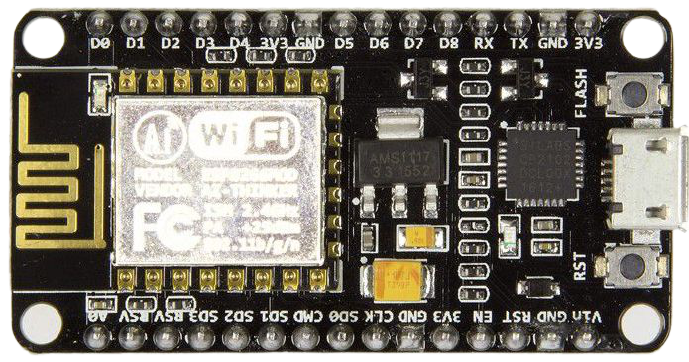

# Hardware Documentation

## Components Needed

1. NodeMCU ESP8266
 
2. Flame Sensor
 
3. Air Quality Sensor
 
4. Temperature and Humidity Sensor

5. Jumper Connecting Wires

6. USB 2.0 to Micro-USB Cable

## Wiring

### Flame Sensor

Flame sensor has 4 pins:
- A0: Analog pin.
- D0: Digital output pin connected to the D0 pin of the NodeMCU.
- GND: Ground pin connected to the G(ground) pin of the NodemMCU.
- VCC: Pin for the operation voltage (3.3-5v) connected to the 3v pin in the NodeMCU.

### Air Quality Sensor

Air Quality sensor has 4 pins:
- A0: Analog pin connected to the A0 pin of the NodeMCU.
- D0: Digital output pin.
- GND: Ground pin connected to the G(ground) pin of the NodemMCU.
- VCC: Pin for the operation voltage (3.3-5v) connected to the 3v pin in the NodeMCU.

### Temperature and Humidity Sensor

Temperature and Humidity sensor has 3 pins:
- VCC: Pin for the operation voltage (3.3-5v) connected to the 3v pin in the NodeMCU.
- Data: Data pin connected to the D5 pin of the NodeMCU.
- GND: Ground pin connected to the G(ground) pin of the NodemMCU.

## Circuit Diagram

### Flame Sensor

### Air Quality Sensor

### Temperature and Humidity Sensor

