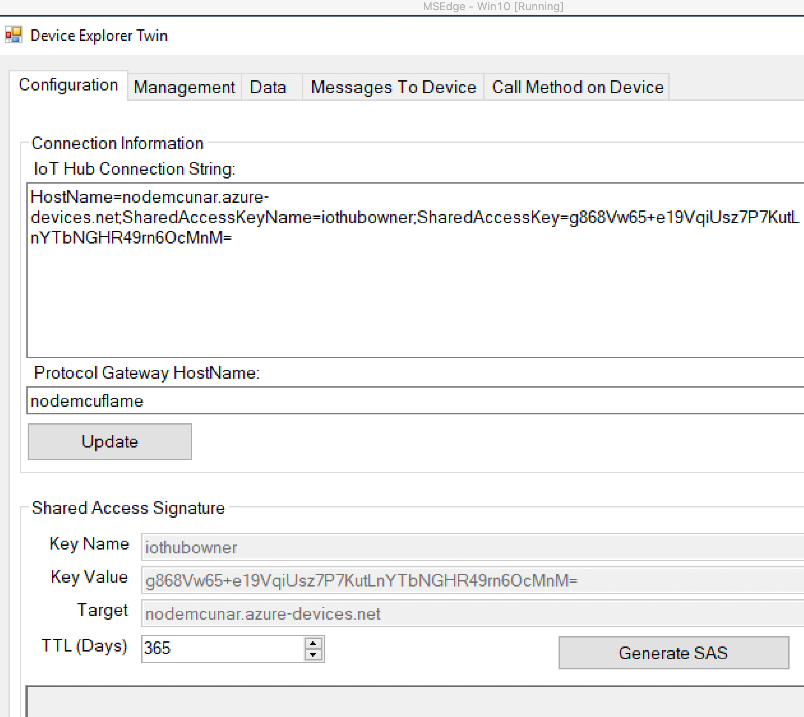

# Azure Storage, Azure BLOB, and Azure Event Hub

## Brief

Route data to Azure Storage, Azure BLOB, and Azure Event Hub.

## Steps

1. In your Iothub directory, go to `Message Routing` under `Messages`.
2. You will be redirected to the message routing tab where you have the option to add a new route.
     

3. We will be creating two routes. The first one has `Storage` as an endpoint, while the second has `event hubs`.
4. We will start with the first one: Choose a name of your liking and then proceed by clicking on storage where you will be redirected to this page:
     
     

5. Pick an endpoint name of your liking and proceed by clicking on the `Pick a container` button.
6. If it’s your first time, you won’t have any storage account. Proceed by adding a storage account and choosing a name of your liking.
7. After that, you will be redirected to also creating a container if you haven’t done so before. Again, choose a name of your liking.
8. After all is done, you will finally go back to the first page. You can choose to change the encoding from `AVRO` to `JSON` or keep it as it is.
9. Finally, you have completed all the requirements and you can finally press create.
10. As for the second route, we will choose `event hubs` in the endpoint field and you’re done!
11. The routes will look as follows:
     
 
 
## Methods


### Method 1: Using MQTT Protocol

 The arduino code used in this method is the same code used [here](../2.%20Microsoft%20Azure/Part%201:%20Azure%20IoT%20Hub.md).

### Method 2: Using PubSubClient Library

#### Steps:

1. Install the following libraries on Arduino IDE if you haven’t done so already:
     - ESP8266WiFi
     - PubSubClient
     - ArduinoJson
2. Open the file `PubSubClient.h` for editing and change the value of `MQTT_MAX_PACKET_SIZE` to 256.
3. In the code below, start by filling in `wifi_ssid` and `wifi_password` with your wifi connection name and password.
4. Next fill in the `thumbprint`. To do so, go to the terminal and type in the following command:
```python 
openssl s_client -servername {azure IoT Hub host name} -connect {azure IoT Hub host name}:443 | openssl x509 -fingerprint -noout
```
Where `{azure IoT Hub host name}` is your IoT Hub Url that comes in the form `<myiothub>.azure-devices.net` (`<myiothub>` is the name of your iothub).

5. Then, fill in the `iothub_url` with your corresponding url, `iothub_deviceid` with the name of the device you created in the iothub, and `iothub_user` with your url/device name (for example `<myiothub>.azure-devices.net/<myCoolDevice>`).
6. As for the `iothub_sas_token`, you should generate this from Device Explorer Twin. In the configuration tab, fill in your `IoTHub Connection String` (copied from azure website) and `HostName` which is the name of device created. Then click on generate SAS and copy the outcome.


   
     
7. Finally for the endpoints substitute `your_Device_id` with the name of the device you created.
###### Arduino Code
```python 
#include <ESP8266WiFi.h>
#include <PubSubClient.h>
#include <WiFiClientSecure.h>
#include <ArduinoJson.h>

// wifi credentials
const char* wifi_ssid = "Your_SSID";
const char* wifi_password = "Your_password";


const char* THUMBPRINT = "Your_thumbprint";

// example: <myiothub>.azure-devices.net
const char* iothub_url = "Your_url";

// example: myCoolDevice
const char* iothub_deviceid = "Your_device_id";

// <myiothub>.azure-devices.net/<myCoolDevice>
const char* iothub_user = "Your_user";

const char* iothub_sas_token = "Your_SAS_Token";

const char* iothub_subscribe_endpoint = "devices/Your_device_id/messages/devicebound/#";

const char* iothub_publish_endpoint = "devices/ Your_device_id /messages/events/";


WiFiClientSecure espClient;
PubSubClient client(espClient);

void setup_wifi() {
  delay(10);

  Serial.println();
  Serial.print("Connecting to wifi");

  WiFi.begin(wifi_ssid, wifi_password);

  while (WiFi.status() != WL_CONNECTED) {
    delay(500);
    Serial.print(".");
  }

  Serial.println("");
  Serial.println("WiFi connected");
  Serial.println("IP address: ");
  Serial.println(WiFi.localIP());
}

// function to connect to MQTT server
void connect_mqtt() {
  while (!client.connected()) {
    Serial.print("Attempting MQTT connection...");
    if (client.connect(iothub_deviceid, iothub_user, iothub_sas_token)) {
      Serial.println("connected");
      client.subscribe(iothub_subscribe_endpoint);
    } else {
      Serial.print("failed, rc=");
      Serial.print(client.state());
      Serial.println("try again in 5 seconds");
      delay(5000);
    }
  }
}

void callback(char* topic, byte* payload, unsigned int length) {
  Serial.print("Message arrived: ");
  for (int i = 0; i < length; i++) {
    Serial.print((char)payload[i]);
  }
  Serial.println('---');
}

void setup() {
  Serial.begin(115200);

  setup_wifi();

  espClient.setFingerprint(THUMBPRINT);
  client.setServer(iothub_url, 8883);
  client.setCallback(callback);

  connect_mqtt();
}


void loop() {
  client.loop();

    Serial.print("is MQTT client is still connected: ");
    Serial.println(client.connected());

    
    String d= output();
    String buffer = getSensorValuesJSON("Your_sensor",d);
returniot(iothub_publish_endpoint,buffer.c_str());
  client.disconnect();
}

String getSensorValuesJSON(String sensor,String value){
  StaticJsonDocument<200> doc;
  doc["sensor"] = sensor;
  doc["data"] = value;
 
  char buffer[256];
  serializeJson(doc, buffer);
  return buffer;
}
bool  returniot (const char* path,const char* value){
  return client.publish(path, value); 
}

```
8. Compile whichever code you like into your NodeMCU after adding the [output](../../Part%20I:%20Collecting%20Data/Collecting%20Data.md) function.
9. Then on the azure website, go to home and choose storage accounts.
10. Enter the storage account you have just created, then go to `containers` under `Blob Services`.
11. Enter the container you have just created, where you will find a file.
12. Note that a file named `[..]` is not an actual file, it will redirect you to the previous file in your directory.
13. After proceeding to this location: `narimanscontainer / nodemcunar / 01 / 2021 / 02 / 13 / 17` , I was able to get hold of my data.

