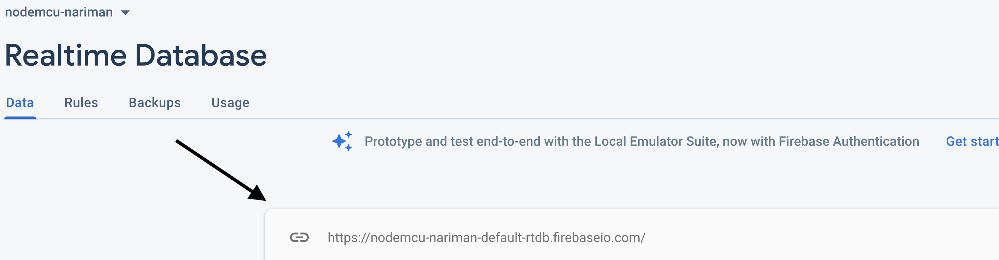
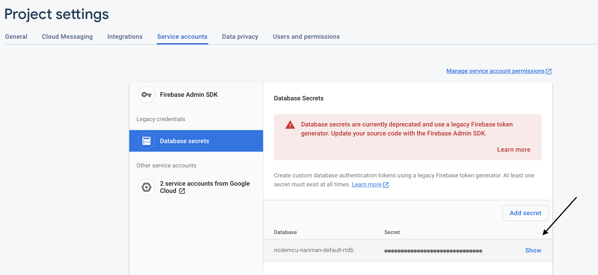

# Firebase Database

## Brief

Send data from NodeMCU to the firebase database as json objects.

## Steps

1. Download the firebase library through the following [link](https://github.com/FirebaseExtended/firebase-arduino)
2. In the downloaded file (firebase-arduino-master), enter the src folder, and search for a file named FirebaseHttpClient.h.
3. Open this file for editing, scroll down to the end of the file, and modify the variable static const char kFirebaseFingerprint[] with your own fingerprint. This is done by visiting this [website](https://www.grc.com/fingerprints.htm), and putting the url of our firebase database.
4. Now, open Arduino, go to sketch->include library-> Add .zip library, and choose the library we just downloaded (firebase-arduino-master).
5. On the firebase website, create a new project, then create a real-time database inside this project.
6. Modify the Arduino code to include your “firebase_host” which you can get from here:
  
  
  eliminating the `https://` in the beginning and the `/` at the end.

7. Also modify the firebase_auth in the Arduino code which you can get by going to Project settings (press on the settings icon near project overview). Enter “Service accounts in the project settings, this is where you will find `database secrets`.
  
 
8. Copy that and this will be your firebase_auth.
9. Modify your wifi ssid and password in the code below.

## Arduino Code

```python
#include <ESP8266WiFi.h>
#include <FirebaseArduino.h>

#define FIREBASE_HOST "Your_host_name"
#define FIREBASE_AUTH "Your_auth"
#define WIFI_SSID "Your_ssid"
#define WIFI_PASSWORD "Your_password"

void setup() {
  Serial.begin(9600);

  // connect to wifi.
  WiFi.begin(WIFI_SSID, WIFI_PASSWORD);
  Serial.print("connecting");
  while (WiFi.status() != WL_CONNECTED) {
    Serial.print(".");
    delay(500);
  }
  Serial.println();
  Serial.print("connected: ");
  Serial.println(WiFi.localIP());
  
  Firebase.begin(FIREBASE_HOST, FIREBASE_AUTH);
}

int n = 0;

void loop() {

String s="message"+String(n);
  // set string value
  String d=output();
  Firebase.setString(s, d);
  // handle error
  if (Firebase.failed()) {
      Serial.print("setting /message failed:");
      Serial.println(Firebase.error());  
      return;
  }
  delay(1000);
  n=n+1;
}
```
## Database Mockups

### Flame Sensor


## Air Quality Sensor


## Temperature and Humidity Sensor


