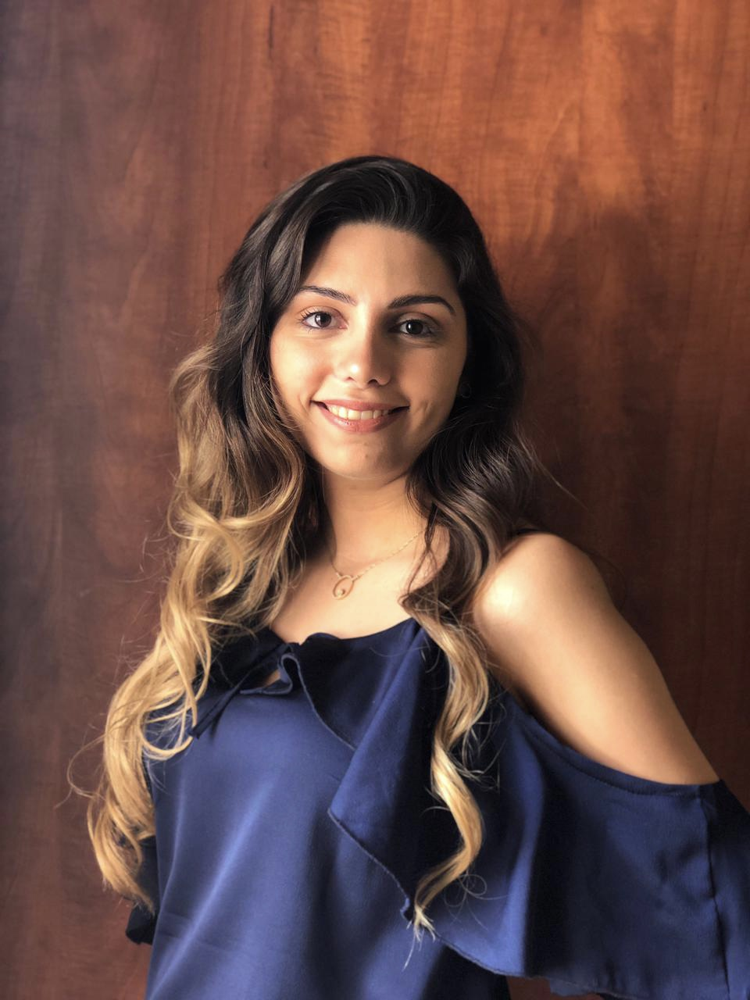
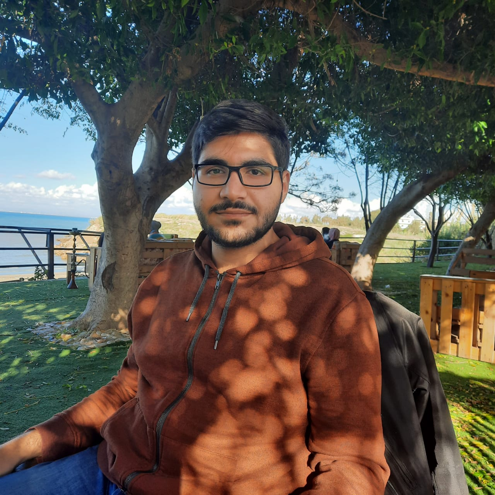

# About Us

| Nariman Rifai                                       | Jana Salameh                                     | Abdullah Fayad                                        |
| -------------                                       | -------------                                    | -------------                                         |
|  |  |   |
| My name is Nariman Rifai, and I’m a senior student at AUB majoring in computer science. Aside from my major, I am interested in singing, working out, and design. I believe that I am a very reliable person, meaning that when I work in a team, my teammates can rely on me to do anything. I am interested in many areas of computer science, especially software engineering, artificial intelligence, and computer graphics.One thing I like about my major is that after finishing my degree, I will still have much to learn. This is why, in the future, I will not stop at just a bachelor’s degree. I will jump at every opportunity, every conference, and every workshop I find that will benefit me in my career. In five years, I should be done with my studies, and hopefully working in my area of expertise, maybe even starting my own company after having gained the experience needed in the field.| My name is Jana Salameh, I graduated from the Lebanese International University with a bachelor’s degree in information technology. I am interested in anything related to technology and evolution if that means making the world a better, easier and safer place to live in. Aside from my major, I found myself to be a naturalist person, reading while enjoying a good view is my favorite escape. In my free time, I enjoy hiking and even spending a night in nature. I believe that I am a very capable person, perfectionist when it comes to finding solutions. I always challenge myself by exploring new things even if they were out of my domain of expertise. Determination is one of my best qualities, I put all my efforts in order to accomplish things on time and I never quit or give up unless they’re done. Five years from now I see myself guiding others on the path into transforming the world to a smarter place in a safe and responsible way that leads to facilitating people’s lives by improving decision making strategies in multiple domains. | Abdullah Fayad, a Bachelor degree graduate in Computer Engineering from Lebanese International University, and now is studying Masters in Computer and Communication Engineering. He is broadly interested in robotics with a particular emphasis on collecting and processing data, along with machine learning and artificial intelligence. For him, this field is very appealing and extremely interesting. He is proud of himself for achieving many of his academic and research goals so far, and for undertaking several projects in the robotics field. Abdullah's humble experience showed him the importance of knowledge sharing, the effect of learning on people’s lives, and the importance of being a "science man" that passes knowledge to others and helps to change the harsh situation in this world. Therefore, in the coming years, Abdullah seeks to reach his goals while sharing his knowledge and experience on a large scale.|

